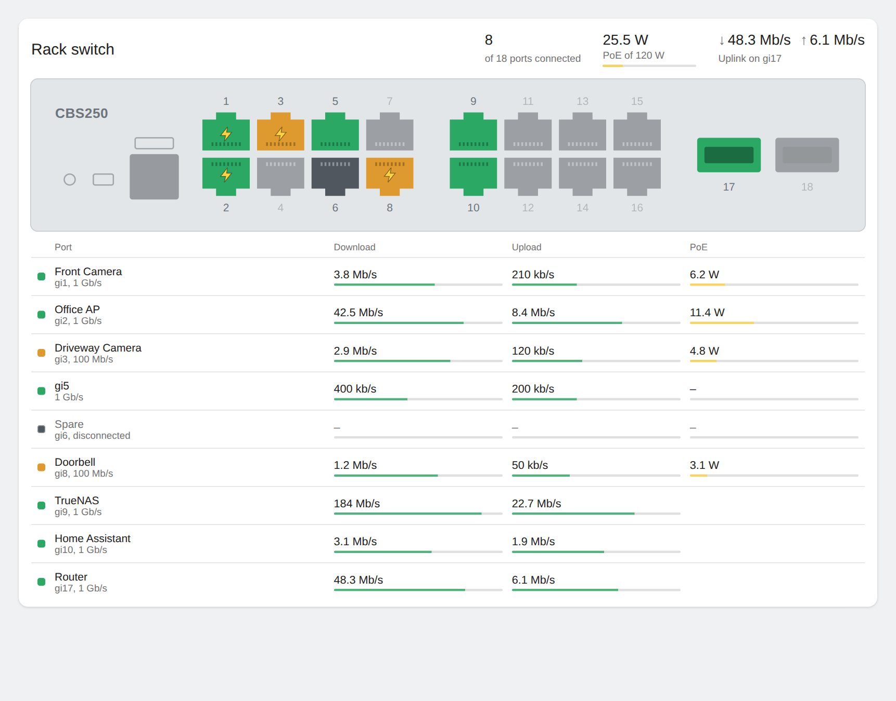
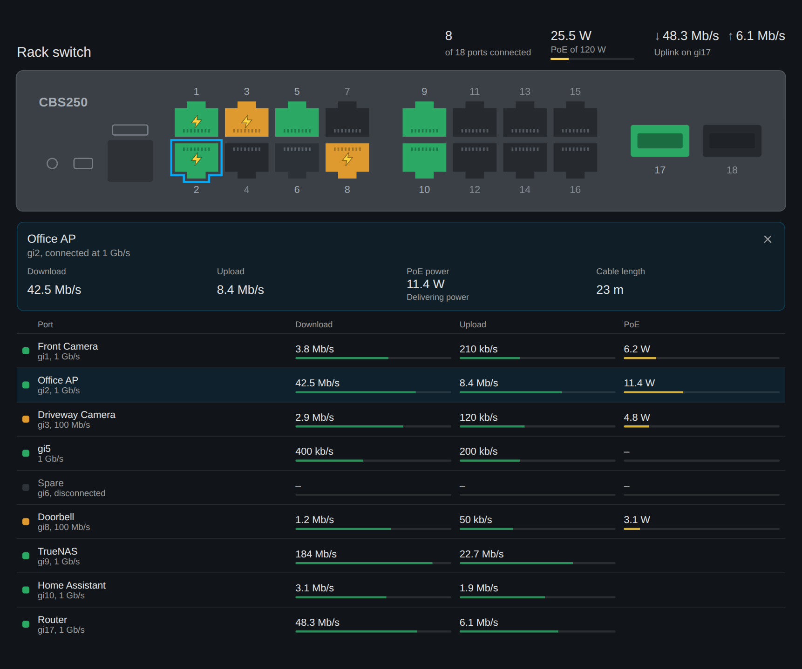

# CBS250 Monitor for Home Assistant

Local-polling SNMP integration for Cisco Business CBS250/CBS350 series switches (built and tested against a CBS250-16P-2G).

## How devices are organised

The switch is one device, and **each port in use gets its own device** linked to it.

- **Entity IDs follow the physical port** and never change: `sensor.gi5_poe_power`, `sensor.gi5_download`. Automations and dashboards stay attached to the port, whatever is plugged into it.
- **Friendly names follow the port description** you set on the switch: the device shows as `Front Camera` and its sensors as `Front Camera PoE power`. The device page shows the port (`Port gi5`). Ports with no description are simply named `gi5`.

A port gets a device when it has a **description set**, an **active link**, or is **delivering PoE**. Empty, unlabelled, unplugged ports are skipped.

- **New ports appear automatically** on the next poll, with no reload needed. Press **Rescan ports** on the switch device to check immediately.
- **Ports are never removed automatically.** Unplugging something just shows link down and 0 W; the device and its history stay, including across restarts.
- **Moving things around:** change the port descriptions on the switch and the friendly names update on the next poll; entity IDs stay put. You can also rename a device in Home Assistant, which takes priority over the switch description until you clear it.
- **To remove a port device**, delete it from its device page. It only comes back if the port qualifies again.

Tip: the switch is the easiest place to manage names (*Port Management > Port Settings > Description*), since one change there updates the device and all its sensors.

## Sensors

**Switch device**
- Total PoE power, with a live per-port breakdown in the `ports` attribute (excluded from the recorder to keep the database lean)
- Ports up (with `total_ports` attribute)
- PoE budget (diagnostic)
- Rescan ports button

**Each port device**
- Download / upload throughput (Mbit/s), from 64-bit counter deltas
- PoE power (W), on PoE ports
- Link status and link speed (diagnostic)
- PoE status, with Cisco's status text as an attribute (diagnostic)
- Cable length, PoE voltage, PoE current (diagnostic, disabled by default — enable per entity)

Cable length is a passive read of the PHY's VCT result, so it never triggers a TDR test or drops a link. It only reports when the switch has a value, which usually needs an active gigabit link.

## Dashboard card

The integration includes a dashboard card that shows the switch's front panel, with each port lit by link state, and a table of download, upload and PoE per port. It loads automatically, so there's no resource to add.



Add it from the card picker (search for *CBS250 switch*), or in YAML:

```yaml
type: custom:cbs250-switch-card
uplink: gi17
```

Jacks are **green** at 1 Gb/s and **amber** at 10 or 100 Mb/s. A bolt marks ports delivering PoE, and faded jacks are unused. Tap a jack or a row to see that port's details, then tap any value to open its history.

| Option | Default | Description |
|---|---|---|
| `uplink` | none | Port name (e.g. `gi17`) whose throughput is shown in the summary |
| `title` | switch name | Card heading |
| `device_id` | first switch found | Only needed with more than one switch |
| `sfp_ports` | `2` | Number of SFP cages on the right of the panel |
| `port_order` | `odd_top` | `odd_top` puts 1, 3, 5, 7 above 2, 4, 6, 8 as on the CBS250. Use `sequential` for 1 to 4 above 5 to 8 |

On narrow screens the table switches to a compact layout with download and upload stacked.



## Switch setup

On the CBS250 web UI (Advanced mode):

1. **Security > TCP/UDP Services** → enable **SNMP Service**
2. **SNMP > Communities** → Add: community string of your choice, SNMP Management Station = your HA IP (or All), Access Mode = **Read Only**
3. Save the running config to startup config

## Install

1. HACS → Integrations → ⋮ → **Custom repositories** → add this repo as type *Integration*
2. Install **CBS250 Monitor**, restart Home Assistant
3. Settings → Devices & Services → **Add Integration** → CBS250 Monitor
4. Enter the switch IP and community string

Options (gear icon on the integration): polling interval (default 30 s) and toggling the cable-length poll.

## Notes / troubleshooting

- SNMP v2c only for now. The community string travels in cleartext, so keep it on your management VLAN and read-only.
- Throughput needs two polls before it shows a value (rate = counter delta / time delta).
- If PoE sensors don't line up with the right ports, verify the PoE index matches ifIndex on your firmware:
  ```bash
  snmpwalk -v2c -c <community> <switch-ip> 1.3.6.1.4.1.9.6.1.101.108.1.1.5
  # rlPethPsePortOutputPower, index = group.port (mW)
  snmpwalk -v2c -c <community> <switch-ip> 1.3.6.1.2.1.31.1.1.1.1
  # ifName, index = ifIndex
  ```
- Cable length uses:
  ```bash
  snmpwalk -v2c -c <community> <switch-ip> 1.3.6.1.4.1.9.6.1.101.90.1.2.1.3
  # rlPhyTestGetResult, index = ifIndex.testType (testType 4 = cable length, metres)
  ```
  If your firmware returns nothing there, turn the option off to save a poll.
- The integration requires `pysnmp >= 7.1`, which is the same library recent Home Assistant core versions ship for the built-in SNMP integration.
